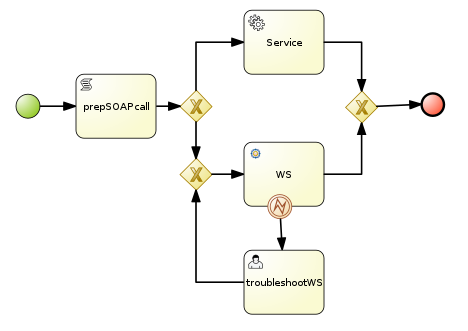
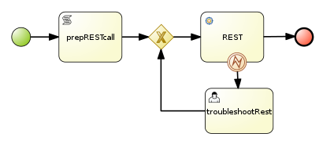
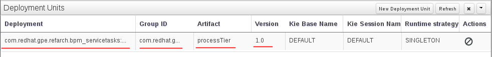
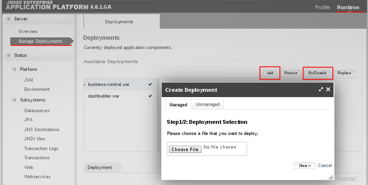

:data-uri:
:toc2:
:rhtlink: link:https://www.redhat.com[Red Hat]
:bpmproduct: link:https://access.redhat.com/site/documentation/en-US/Red_Hat_JBoss_BPM_Suite/[Red Hat's BPM Suite 6 product]

image::images/rhheader.png[width=900]

:numbered!:
[abstract]
== Red Hat GPE Reference Architecture:  BPM Service Tasks

:numbered:

== Overview

=== SOAP Service Tasks

to-do:  elaborate on details

=== REST Service Task 

to-do: elaborate on details

=== JMS ServiceTask 
to-do

== Pre-Requisites
The remainder of this documentation provides instructions for installation, configuration and execution of this reference architecture. 
The following is a list of pre-requisites:

. maven 3.0.5 (or greater)
. git client
. familiarity with {bpmproduct}
. proficiency with the _bash_ shell 

== Config and Deployment:  Local Environment

=== local:  Clone this reference architecture
This reference architecture will be cloned both in your local computer as well as in your remote BPM Suite 6 Openshift environment.
To clone this reference architecture in your local environment, execute the following:

--------
git clone https://github.com/jboss-gpe-ref-archs/bpm_servicetasks.git
--------

Doing so will create a directory in your local computer called:  bpm_servicetasks.
For the purposes of this documentation, this directory will be referred to as $REF_ARCH_HOME.

=== local: Build the Reference Architecture
This reference architecture includes various sub-projects that need to be built locally. 
To build the various sub-projects, execute the following:

. cd $REF_ARCH_HOME
. mvn clean install -DskipTests

== Configuration and Deployment:  BPM Suite 6

=== BPM Suite 6:  Clone this reference architecture
This reference architecture includes a KIE project called: _processTier_ .
The _processTier_ project includes several BPMN2 process definitions that show-case invocation of remote SOA services via standard transports.

Use the following steps to clone this reference architecture in BPM Suite 6:

. Log into the Business-Central web application of BPM Suite 6
. navigate to:  Authoring -> Administration.
. Select `Organizational Units` -> `Manage Organizational Units`
. Under `Organizational Unit Manager`, select the `Add` button
. Enter a name of _gpe_ and an owner of _jboss_. Click `OK`
. Clone this fsw_bpms_integration repository in BPM Suite 6
.. Select `Repositories` -> `Clone Repository` .  
.. Populate the _Clone Repository_ box as follows and then click _Clone_ :

image::images/clone_repo.png[]

Enter _bpmservicetask_ as the value of the _repository name_.  
The value of _Git URL_ is the URL to this reference architecture in github:

-----
https://github.com/jboss-gpe-ref-archs/bpm_servicetask.git
-----

Once successfully cloned, BPM Suite 6 will pop-up a new dialog box with the message:  _The repository is cloned successfully_

=== BPM Suite 6:  Add domain-model jar to classpath of business-central
The _processTier_ KIE project references a domain model that is included in the $REF_ARCH_HOME/domain directory of this reference architecture.

One approach toward making this domain model available to the _processTier_ KIE project is to manually upload libraries to the BPM Suite 6  _Artifact Repository_ and then define dependencies in the KIE project to those newly  uploaded libraries.
As of BPM Suite 6.0.2, this approach however causes classloader inconsistencies when invoking SOAP services with complex types.
When using the SOAP based WorkItemHandlers, it is not sufficient to make the domain model jar visible to the KIE project only.
Instead, the domain model jar needs to be made visible to the entire classpath of the BPM Suite business-central web artifact.

Since this reference architecture does show-case use of invoking a remote SOAP service that requires a complex-type in its payload, the domain model jar will be made visible to the classpath of the business-central web archive. 
JBoss EAP 6 allows for two different options for adding the libraries to the classpath of a web artifact (in this case:  business-central.war):

. Deploy the domain model jar as a static shared JBoss module and enter in an explicit dependency on this new JBoss module in business-central.war/WEB-INF/jboss-deployment-structure.xml
. Add the domain model jar to: business-central.war/WEB-INF/lib

For the purpose of this reference architecture, the latter approach will be used.
In your remote BPM Suite 6 enabled OpenShift environment, execute a command similar to the following:

------
scp $REF_ARCH_HOME/domain/target/domain-1.0.jar  <ssh_url_to_your_remote_gear>:~/bpms/standalone/deployments/business-central.war/WEB-INF/lib
------

=== BPM Suite 6:  Discussion regarding domain models
In this reference architecture, a single java library with domain model classes is shared between the _processTier_ and the _servicesTier_.
The source code and build configuration for these domain model classes reside in $REF_ARCH_HOME/domain.
The previous section discussed the requirement to add this external domain model library to the business-central.war/WEB-INF/lib directory.

As an alternative, BPM Suite 6 includes a _Data Modeler_ tool.
The Data Modeler tool allows for the creation of domain model classes to be used for your BPM Suite 6 KIE projects.
Specifically, these Data Modeler generated domain-model classes are useful at design-time to facilate creation of rules, BPMN2 process definitions, forms, etc.
These domain-model classes are also useful at runtime to facilitate the execution of rules and process instances included in a KIE project.
In summary, the scope of a Data Modeler generated _processTier_ domain model is specific to KIE workbench tooling and KIE project execution.

This _processTier_ domain model should generally not be used outside the scope of the KIE workbench nor KIE project execution.
When integration between a process instance and SOA services is needed, it is a best practice to define an additional _integration_ domain model.
Transformations between _integration_ and _processTier_ domain models are common:

. *inbound through BPM Suite 6 Execution Server:* 
A BPMN2 process definition should conduct as its first node the following transformation:  _integrationDomain_ -> _processTierDomain_ 
. *outbound through Service Tasks:*
A BPMN2 process definition should conduct the following transformtion just prior to a service task node:  _processTierDomain_ -> _integrationDomain_ 

=== BPM Suite 6:  Build and Deploy _processTier_ project
. Build and Deploy the _processTier_ project by executing the following:
.. Authoring -> Project Authoring -> Tools -> Project Editor -> Build and Deploy
. If interested, verify deployment:
.. Deploy -> Deployments

=== BPM Suite 6:  Upload and Enable SOA Services
In the $REF_ARCH_HOME/serviceTier directory are various services that when deployed will be exposed via standard transports:  REST, SOAP and JMS.
These services are implemented utilizing stock JEE functionality provided by the underlying JBoss Enterprise Application Platform.
In this reference architecture, these SOA services are invoked by the corresponding BPM _Service Tasks_ used in the process definitions included in the _processTier_ KIE project.
Upload and enable these services to your remote JBoss EAP environment via following procedure:

. Navigate your browser to the JBoss EAP Management console
. Click: Runtime -> Manage Deployments -> Add
. In the _Create Deployment_ pop-up, click _Choose File_ and navigate to $REF_ARCH_HOME/serviceTier/target/bizservices.war
. Once uploaded, highlight the new web artifact and click the _En/Disable_ button

[start=5]
. Upon doing so, the jboss server.log file will log the deployment of the various services similar to the following:

----------
JBAS018210: Register web context: /bizservices
JBAS018559: Deployed "bizservices.war" (runtime-name : "bizservices.war")

----------

All SOA services are packaged in the same _bizservices.war_ web artifact.

== Manual Testing
All BPMN2 process definitions included in the _processTier_ KIE project can be started manually via BPM Central.
To do so, execute the following:

. Navigate to:  Process Management -> Process Definitions
. Select the _Start_ icon of any of the listed process definitions.
. A form should appear with only a _play_ button to start that specific process.
. Make sure your $JBOSS_HOME/standalone/log/server.log is being tailed and click this play button.

=== RESULTS:  rest_servicetask
Upon starting an instance of rest_servicetask, the following should appear in the server.log:

--------------
[stdout] prepRESTCall() policyString = {"driver":{"age":22,"creditScore":null,"dlNumber":null,"driverName":"alex","numberOfAccidents":0,"numberOfTickets":1,"ssn":null},"policyType":null,"price":500,"priceDiscount":null,"vehicleYear":2014}
[stdout] prepRESTcall() urlSting = http://192.168.5.5:8080/bizservices/policy
[AuditReview] (http-/192.168.5.5:8080-4) reviewQuote() contentType = application/json : policyObj = 
    policyType : null
    price : 500
    priceDiscount : null
    vehicle year : 2014
    driver : 
        driverName : alex
        dlNumber : null
        age : 22
        accidents : 0
        tickets : 1
        SSN : null
        creditScore : null
[stdout] (http-/192.168.5.5:8080-9) REST.onExit() processResults = true
--------------

The BPMN REST ServiceTask has successfully executed an HTTP POST to a RESTful service.
The content of the HTTP request was the JSON representation of a Policy object.

=== RESULTS:  soap_servicetask
Upon starting an instance of soap_servicetask, the following should appear in the server.log:

== To-Do
* classpath problems with CXF Dynamic Dispatch
** https://mojo.redhat.com/docs/DOC-942546
* RESTWorkItemHandler:  Exception Handling
** https://bugzilla.redhat.com/show_bug.cgi?id=1098137
* RESTWorkItemHandler:  automated (un)marshalling
** https://bugzilla.redhat.com/show_bug.cgi?id=1098140

=======
