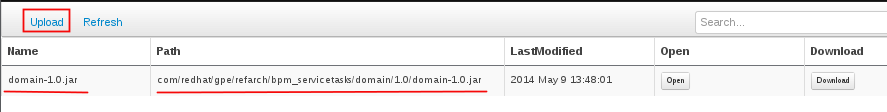
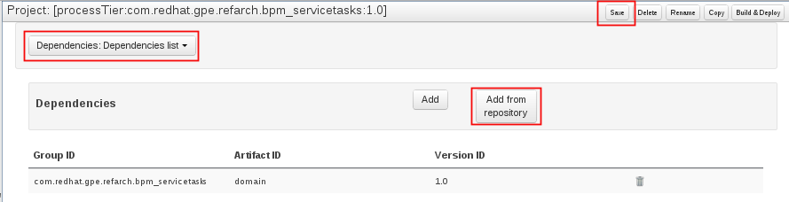

:data-uri:
:toc2:
:rhtlink: link:https://www.redhat.com[Red Hat]

image::images/rhheader.png[width=900]

:numbered!:
[abstract]
== Red Hat GPE Reference Architecture:  BPM Service Tasks

:numbered:

== Overview

=== BPMN2 ServiceTask 

image::images/bpmnservicetask.png[]

=== REST ServiceTask 

image::images/bpmnservicetask.png[]

=== JMS ServiceTask 
to-do

== Pre-Requisites
The remainder of this documentation provides instructions for installation, configuration and execution of this reference architecture. 
The following is a list of pre-requisites:

. maven 3.0.5 (or greater)
. git client
. familiarity with {bpmproduct}
. proficiency with the _bash_ shell 

== Configuration and Deployment:  Local Environment

=== local:  Clone this reference architecture
This reference architecture will be cloned both in your local computer as well as in your remote BPM Suite 6 Openshift environment.
To clone this reference architecture in your local environment, execute the following:

--------
git clone https://github.com/jboss-gpe-ref-archs/bpm_servicetasks.git
--------

Doing so will create a directory in your local computer called:  bpm_servicetasks.
For the purposes of this documentation, this directory will be referred to as $REF_ARCH_HOME.

=== local: Build the Reference Architecture
This reference architecture includes various sub-projects that need to be built locally. 
To build the various sub-projects, execute the following:

. cd $REF_ARCH_HOME
. mvn clean install -DskipTests

== Configuration and Deployment:  BPM Suite 6

=== BPM Suite 6:  Clone this reference architecture
This reference architecture includes a KIE project called: _processTier_ .
The _processTier_ project includes several BPMN2 process definitions that show-case invocation of remote SOA services via standard transports.

Use the following steps to clone this reference architecture in BPM Suite 6:

. Log into the Business-Central web application of BPM Suite 6 and navigate to:  Authoring -> Administration.
. Select `Organizational Units` -> `Manage Organizational Units`
. Under `Organizational Unit Manager`, select the `Add` button
. Enter a name of _gpe_ and an owner of _jboss_. Click `OK`
. Clone this fsw_bpms_integration repository in BPM Suite 6
.. Select `Repositories` -> `Clone Repository` .  
.. Populate the _Clone Repository_ box as follows and then click _Clone_ :

image::images/clone_repo.png[]

Enter _bpmservicetask_ as the value of the _repository name_.  
The value of _Git URL_ is the URL to this reference architecture in github:

-----
https://github.com/jboss-gpe-ref-archs/bpm_servicetask.git
-----

Once successfully cloned, BPM Suite 6 will pop-up a new dialog box with the message:  _The repository is cloned successfully_

=== BPM Suite 6:  Add domain-model jar to classpath of _processTier_ project
The _processTier_ KIE project references a domain model that is included in the $REF_ARCH_HOME/domain directory of this reference architecture.
One approach toward making this domain model available to the _processTier_ KIE project is to manually upload libraries to the BPM Suite 6  _Artifact Repository_ and then define dependencies in the KIE project to those newly  uploaded libraries.

. In your browser, navigate to :   Authoring -> Project Authoring .  Several exceptions related to the inability to find domain model classes should appear in the _Problems_ window.  This is to be expected at this time.
. navigate to :  Authoring -> Artifact Repository -> Upload
. In the _Artifact upload_ pop-up, select _Choose File_ and navigate to $REF_ARCH_HOME/domain/target/domain-1.0.jar in your local environment.
. Click Upload

[start=5]
. navigate to:  Authoring -> Project Authoring -> Tools -> Project Editor -> Dependencies:  Dependencies list.
. click:  _Add from repository_ followed by _Select_ on the newly uploaded _domain-1.0.jar_ library.
. click _Save_ .
. Notice that upon saving the _processTier_ project, the previous class related problems are now resolved.

[start=9]
. Build and Deploy the _processTier_ project by executing the following:
.. Authoring -> Project Authoring -> Tools -> Project Editor -> Build and Deploy
. If interested, verify deployment:
.. Deploy -> Deployments

=== BPM Suite 6:  Upload and Enable Services
In the $REF_ARCH_HOME/serviceTier directory are various services that when deployed will be exposed via standard transports:  REST, SOAP and JMS.
These services are implemented utilizing stock JEE functionality provided by the underlying JBoss Enterprise Application Platform.
Upload and enable these services to your remote JBoss EAP environment via following procedure:

. Navigate your browser to the JBoss EAP Management console
. Click: Runtime -> Manage Deployments -> Add
. In the _Create Deployment_ pop-up, click _Choose File_ and navigate to $REF_ARCH_HOME/serviceTier/target/bizservices.war
. Once uploaded, highlight the new web artifact and click the _En/Disable_ button

[start=5]
. Upon doing so, the jboss server.log file will log the deployment of the various services similar to the following:

----------
JBAS018210: Register web context: /bizservices
JBAS018559: Deployed "bizservices.war" (runtime-name : "bizservices.war")

----------

All SOA services are packaged in the same _bizservices.war_ web artifact.

== Manual Testing
All BPMN2 process definitions included in the _processTier_ KIE project can be started manually via BPM Central.
To do so, execute the following:

. Navigate to:  Process Management -> Process Definitions
. Select the _Start_ icon of any of the listed process definitions.
. A form should appear with only a _play_ button to start that specific process.
. Make sure your $JBOSS_HOME/standalone/log/server.log is being tailed and click this play button.

=== RESULTS:  rest_servicetask
Upon starting an instance of rest_servicetask, the following should appear in the server.log:

--------------
[stdout] prepRESTCall() policyString = {"driver":{"age":22,"creditScore":null,"dlNumber":null,"driverName":"alex","numberOfAccidents":0,"numberOfTickets":1,"ssn":null},"policyType":null,"price":500,"priceDiscount":null,"vehicleYear":2014}
[stdout] prepRESTcall() urlSting = http://192.168.5.5:8080/bizservices/policy
[AuditReview] (http-/192.168.5.5:8080-4) reviewQuote() contentType = application/json : policyObj = 
    policyType : null
    price : 500
    priceDiscount : null
    vehicle year : 2014
    driver : 
        driverName : alex
        dlNumber : null
        age : 22
        accidents : 0
        tickets : 1
        SSN : null
        creditScore : null
[stdout] (http-/192.168.5.5:8080-9) REST.onExit() processResults = true
--------------

The BPMN REST ServiceTask has successfully executed an HTTP POST to a RESTful service.
The content of the HTTP request was the JSON representation of a Policy object.

=== RESULTS:  soap_servicetask
Upon starting an instance of soap_servicetask, the following should appear in the server.log:

TO_DO:  currently experiencing problems with CXF Dynamic Dispatch

== Performance Testing

== To-Do
. resolve this problem
. resolve that problem
=======
