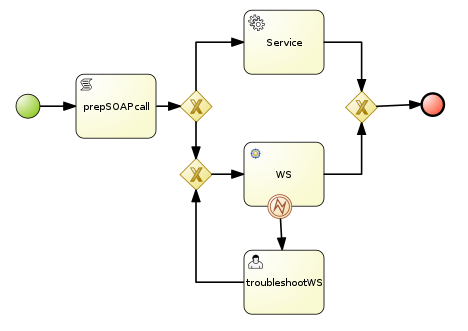
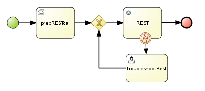
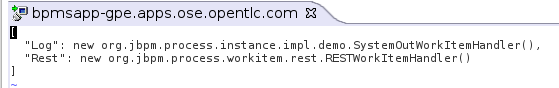
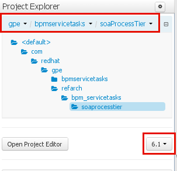
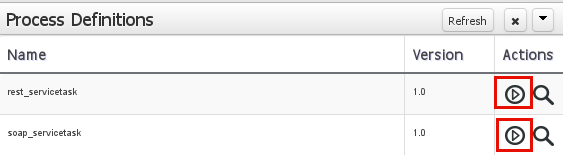

:data-uri:
:toc2:
:rhtlink: link:https://www.redhat.com[Red Hat]
:bpmproduct: link:https://access.redhat.com/site/documentation/en-US/Red_Hat_JBoss_BPM_Suite/[Red Hat's BPM Suite 6 product]
:mwlaboverviewsetup: link:http://people.redhat.com/jbride/labsCommon/setup.html[Middleware Lab Overview and Set-up]

image::images/rhheader.png[width=900]

:numbered!:
[abstract]
== Red Hat GPE Reference Architecture:  BPM Service Tasks

:numbered:

== Overview

=== SOAP Service Tasks

BPM Suite 6 includes two out-of-the-box implementations to invoke remote SOAP services from a BPM Process.

. *BPMN2 ServiceTask*
.. Alligns with the Service Task defined in the BPMN2 specification
.. Allows for invoking either a SOAP service or a Java class
.. SOAP client leverages Apache CXF Dynamic Dispatch
.. As of 6.0.2, the WorkItemHandler implementation (org.jbpm.process.workitem.bpmn2.ServiceTaskHandler) does not extend AbstractLogOrThrowWorkItemHandler
... ServiceTaskHandler class will extend AbstractLogOrThrowWorkItemHandler in BPM Suite 6.1
.. As of 6.0.2, _ServiceTask_ mapping is not included in the out-of-the-box _CustomWorkItemHandlers.conf_ configuration file.
. *BPM Suite 6 WebService Service Task*
.. SOAP client leverages Apache CXF Dynamic Dispatch
.. WorkItemHandler implementation extends AbstractLogOrThrowWorkItemHandler
.. _WebService_ mapping is included in the out-of-the-box _CustomWorkItemHandlers.conf_ configuration file.

Included in this reference architecture is a BPMN2 process definition called `soap_servicetask` that demonstrates use of both SOAP Service Tasks.

==== CXF Dynamic Dispath : complex types
Both of BPM Suite 6 SOAP-based WorkItemHandlers introduced previously leverage Apache CXF Dynamic Dispatch to invoke remote SOAP services.
An Apache CXF Dynamic Dispatch client is capable of invoking remote SOAP services with JAXB annotated complex types.
In order for those complex types to be marshalled into XML, they need to be on the Java classpath of BPM Suite 6.
The complex type classes must *not* be in the Kie project .... otherwise, ClassCastExceptions will occur.

To-Do:  Modify as per https://access.redhat.com/solutions/800663

==== WSDLs and Task parameters
The WebService and BPMN2 Service Tasks expect several parameters passed to.
The values of those parameters in the `soap_servicetask` BPMN2 definition are as follows:

. *Namespace*
+
URN of SOAP service to invoke

. *Parameter*
+
Domain model payload that is automatically marshalled by CXF client and sent to remote SOAP service

. *Url*
+
WSDL URL of remote SOAP service.
+
Applicable only for the `WebService` Service Task.
The value of this parameter is created dynamically in the `prepSOAPcall` script task of th `soap_servicetask` BPMN2.
+
When using the `BPMN2 ServiceTask` the value of the WSDL URL and Namespace need to be hard-coded in an import to the BPMN2 process of type `wsdl`:
+

. *Operation*
+
SOAP operation to invoke

. *Interface*
+
SOAP service interface name

==== Outstanding issues

* classpath problems with CXF Dynamic Dispatch
** https://mojo.redhat.com/docs/DOC-942546

=== REST Service Task 

The BPM Suite 6 REST Service Task allows for invocation of a remote RESTful services.

Included in this reference architecture is a BPMN2 process definition called `rest_servicetask`.
Of interest are the property assignments for the REST service task node:

. *Method*
+
HTTP method to be executed.
Default to `GET`.
Supports:  `GET, POST, PUT and DELETE`

. *Url*
+
Mandatory field that defines the resource location to be invoked.
In this reference architecture, the value of the `Url` field is set dynamically in the `prepRESTcall` script task

. *ContentType*
+
Data type of payload.
Mandatory when using POST and PUT.

. *Content*
+
Actual payload to be sent.
Mandatory when using POST and PUT.
In this reference architecture, the value of the `Content` field is set dynamically in the `prepRESTcall` script task

. *Result*
+
Response payload (if any) is mapped to a String process variable called : `processResults`.

==== Outstanding issues

* RESTWorkItemHandler:  Exception Handling
** https://bugzilla.redhat.com/show_bug.cgi?id=1098137
* RESTWorkItemHandler:  automated (un)marshalling
** https://bugzilla.redhat.com/show_bug.cgi?id=1098140

== Pre-Requisites
The remainder of this documentation provides instructions for installation, configuration and execution of this reference architecture in Red Hat's Partner Demo System.
The following is a list of pre-requisites:

. OPENTLC-SSO credentials
+
`OPENTLC-SSO` user credentials are used to log into the Red Hat Partner Demo System (PDS).
If you do not currently have an `OPENTLC-SSO` userId, please email: `OPEN-program@redhat.com`.

. Familiarity with Partner Demo System
+
If you are not already familiar with Red Hat's `Partner Demo System`, please execute what is detailed in the {mwlaboverviewsetup} guide.
Doing so will ensure that you are proficient with the tooling and workflow needed to complete this reference architecture in an OpenShift Platform as a Service environment.

. Familiarity with {bpmproduct}

== Provision BPM Suite 6 application

. Open the `Openshift Explorer` panel of the `JBoss` perspective of JBDS
. Right-click on the previously created connection to `broker00.ose.opentlc.com`.
+
Using your `OPENTLC-SSO` credentials, a connection to `broker00.ose.opentlc.com` should already exist after having completed the {mwlaboverviewsetup} guide.

. Select: `New -> Application` .
+
Since you have already created a domain from the previous introductory lab, the workflow for creation of a new application will be slightly different than what you are used to.
In particular, the OSE plugin will not prompt you for the creation of a new domain.

. The following `New or existing OpenShift Application` pop-up should appear:
+
image::images/new_OSE_app_bpm.png[]

.. In the `Name` text box, enter: `bpmsapp`
.. From the `Type` drop-down, select: JBoss BPMS 6.0 (rhgpe-bpms-6.0)
.. From the `Gear profile` drop-down, select: pds_medium
. Click `Next`
. A new dialogue appears entitled `Set up Project for new OpenShift Aplication`.
+
Check the check box for `Disable automatic maven build when pushing to OpenShift`.
Afterwards, Click `Next`.

. A new dialogue appears entitled `Import an existing OpenShift application`.
+
Even though it will not be used, you will be forced to clone the remote git enabled project associated with your new OpenShift application.
Select a location on your local filesystem where the git enabled project should be cloned to.
+
image::images/gitclonelocation_bpm.png[]

. Click `Finish`
. The OSE plugin of JBDS will spin for a couple of minutes as the remote BPM Suite 6 enabled OpenShift application is created.
. Eventually, the OSE plugin will prompt with a variety of pop-up related details regarding your new application.
+
Click through all of them except when you come to the dialogue box entitled `Publish bpmsapp?`.
For this dialogue box, click `No`
+
image::images/publishbpmslab.png[]

=== BPM Suite 6 App Verification

. Using the `Remote System Explorer` perspective of JBDS, open an SSH terminal and tail the `bpms/standalone/log/server.log` of your remote BPM Suite 6 enabled OSE application
. Log messages similar to the following should appear:
+
image::images/newbpmlogfile.png[]

== Config and Deployment:  Local Environment

=== local: Clone this reference architecture
This reference architecture will be cloned both in your local computer as well as in your remote BPM Suite 6 Openshift environment.
To clone this reference architecture in your local environment, execute the following:

. Open the `Git` perspective of JBDS.
. In the `Git Repositories` panel, click the link that allows you to `Clone a Git Repository and add the clone to this view`
. A pop-up should appear with a name of `Source Git Repository`
. In the `URI` field, enter the following:
+
-----
https://github.com/jboss-gpe-ref-archs/bpm_servicetasks.git
-----

. Click `Next`
+
image::images/clone_repo_to_local.png[]

. Continue to click `Next` through the various screens
+
On the pop-up screen entitled `Local Destination`, change the default value of the `Directory` field to your preferred location on disk.
For the purposes of the remainder of these instructions, this directory on your local filesystem will be referred to as:  $REF_ARCH_HOME

. On the last screen of the `Clone Git Repository` pop-up, click `Finish`
+
Doing so will clone this `bpm_servicetasks` project to your local disk

. In JBDS, switch to the `Project Explorer` panel and navigate to:  `File -> Import -> Maven -> Existing Maven Projects`
. In the `Root Directory` field of the `Maven Projects` pop-up, navigate to the location on disk where this project was just cloned to and select `bpm_servicetasks/soa` .
+

. Click `next` through the various pop-up panels and finally `Finish`.
. Your `Project Explorer` panel should now include the following mavenized projects
+
image::images/maven_projects.png[]

=== local: Build the Reference Architecture
This reference architecture includes various sub-projects that need to be built locally.
To build the various sub-projects, execute the following:

. In the `Project Explorer` panel of JBDS, right-click on the `parent` project
. Navigate to: `Run As -> Maven Install`
. In the `Console` panel, a `BUILD SUCCESS` log message should appear.
+

=== BPM Suite 6:  Add domain-model jar to classpath of business-central
The _soaProcessTier_ KIE project references a domain model that is included in the $REF_ARCH_HOME/domain directory of this reference architecture.

One approach toward making this domain model available to the _soaProcessTier_ KIE project is to manually upload libraries to the BPM Suite 6  _Artifact Repository_ and then define dependencies in the KIE project to those newly  uploaded libraries.
As of BPM Suite 6.0.2, this approach however causes classloader inconsistencies when invoking SOAP services with complex types.
When using the SOAP based WorkItemHandlers, it is not sufficient to make the domain model jar visible to the KIE project only.
Instead, the domain model jar needs to be made visible to the entire classpath of the BPM Suite business-central web artifact.

Since this reference architecture does show-case use of invoking a remote SOAP service that requires a complex-type in its payload, the domain model jar will be made visible to the classpath of the business-central web archive. 
JBoss EAP 6 allows for two different options for adding the libraries to the classpath of a web artifact (in this case:  business-central.war):

. Deploy the domain model jar as a static shared JBoss module and enter in an explicit dependency on this new JBoss module in business-central.war/WEB-INF/jboss-deployment-structure.xml
. Add the domain model jar to: business-central.war/WEB-INF/lib

For the purpose of this reference architecture, the latter approach will be used.
To do so, execute the following:

. In the `Project Explorer` panel of the `JBOSS` perspective of JBDS, right-click on the `domain/target/bpm_rulesMgmt_domain.jar` in `Project Explorer` and select `Copy`.
+

.. In the `Remote System Explorer` perspective of JBDS, navigate to `bpmsapp-<your domain>.apps.ose.opentlc.com -> Sftp Files -> My Home -> bpms -> standalone -> deployments -> business-central.war -> WEB-INF -> lib`
.. Right-click and select `Paste`
+
image::images/pastedomainjarintobizcentral.png[]

=== BPM Suite 6:  Discussion regarding domain models
In this reference architecture, a single java library with domain model classes is shared between the _soaProcessTier_ and the _servicesTier_.
The source code and build configuration for these domain model classes reside in $REF_ARCH_HOME/domain.
The previous section discussed the requirement to add this external domain model library to the business-central.war/WEB-INF/lib directory.

As an alternative, BPM Suite 6 includes a _Data Modeler_ tool.
The Data Modeler tool allows for the creation of domain model classes to be used for your BPM Suite 6 KIE projects.
Specifically, these Data Modeler generated domain-model classes are useful at design-time to facilate creation of rules, BPMN2 process definitions, forms, etc.
These domain-model classes are also useful at runtime to facilitate the execution of rules and process instances included in a KIE project.
*In summary, the scope of a Data Modeler generated _soaProcessTier_ domain model is specific to KIE workbench tooling and KIE project execution.*

*This _soaProcessTier_ domain model should generally not be used outside the scope of the KIE workbench and KIE project execution.*
*When integration between a process instance and SOA services is needed, it is a best practice to define an additional _integration_ domain model.*
Transformations between _integration_ and _soaProcessTier_ domain models are common:

. *inbound through BPM Suite 6 Execution Server:* 
A BPMN2 process definition should conduct as its first node the following transformation:  _integrationDomain_ -> _processTierDomain_ 
. *outbound through Service Tasks:*
A BPMN2 process definition should conduct the following transformtion just prior to a service task node:  _processTierDomain_ -> _integrationDomain_ 

=== BPM Suite 6:  Define Service Task mapping
The various process definitions included in this reference architecture utilize Service Tasks to invoke remote SOA services.
The name of these Service Tasks needs to be mapped to a jBPM WorkItemHandler implementation.
This mapping subsequently needs to be registered with the process engine.
The mapping between Service Task name and its workItemHandler implementation can be defined in a pre-existing BPM Suite 6 configuration file.
This can be accomplished as follows:

. In the `Remote System Explorer` perspective, ssh into the `bpmsapp` gear.
. execute: vi `~/bpms/standalone/deployments/business-central.war/WEB-INF/classes/META-INF/CustomWorkItemHandlers.conf`
.. notice the existing mappings for various base-product Service Tasks (Log, WebService, Rest)
.. add a comma to the end of the last service task mapping and then append the following:
+
-----
"Service Task": new org.jbpm.process.workitem.bpmn2.ServiceTaskHandler(ksession)
-----
+

. Save the change and quit
. Switch back to the `OpenShift Explorer` panel in JBDS and restart the `bpmsapp` application.

=== BPM Suite 6:  Clone this reference architecture
This reference architecture includes a KIE project called: _soaProcessTier_ .
The _soaProcessTier_ project includes several BPMN2 process definitions that show-case invocation of remote SOA services via standard transports.

Use the following steps to clone this reference architecture in BPM Suite 6:

. Log into the `BPM Console`  web application of BPM Suite 6
+
The userId to use is:  `jboss`  and the password to use is:  `brms`

. navigate to:  Authoring -> Administration.
. Select `Organizational Units` -> `Manage Organizational Units`
. Under `Organizational Unit Manager`, select the `Add` button
. Enter a name of _gpe_ and an owner of _jboss_. Click `OK`
. Clone this fsw_bpms_integration repository in BPM Suite 6
.. Select `Repositories` -> `Clone Repository` .  
.. Populate the _Clone Repository_ box as follows and then click _Clone_ :

image::images/clone_repo.png[]

Enter _bpmservicetask_ as the value of the _repository name_.  
The value of _Git URL_ is the URL to this reference architecture in github:

-----
https://github.com/jboss-gpe-ref-archs/bpm_servicetasks.git
-----

Once successfully cloned, BPM Suite 6 will pop-up a new dialog box with the message:  _The repository is cloned successfully_

=== BPM Suite 6:  Build and Deploy _soaProcessTier_ project
Build and Deploy the _soaProcessTier_ project by executing the following:

. Navigate to `Authoring -> Project Authoring`
. In the `Project Explorer` panel, ensure that `gpe -> bpmservicetasks -> soaProcessTier` is selected
+

. Navigate to `Authoring -> Project Authoring -> Tools -> Project Editor`
. In the `Project Editor` panel, click `Build and Deploy`
. If interested, verify deployment:
.. Deploy -> Deployments
+
image::images/deployment.png[]

=== BPM Suite 6:  Upload and Enable SOA Services
In the $REF_ARCH_HOME/serviceTier directory are various services that when deployed will be exposed via standard protocols:  REST & SOAP.
These services are implemented utilizing stock JEE functionality provided by the underlying JBoss Enterprise Application Platform.
In this reference architecture, these SOA services are invoked by the corresponding BPM _Service Tasks_ used in the process definitions included in the _processTier_ KIE project.
Upload and enable these services to your remote JBoss EAP environment via the following procedure:

. Navigate your browser to the JBoss EAP Management console
. Click: Runtime -> Manage Deployments -> Add
. In the _Create Deployment_ pop-up, click _Choose File_ and navigate to $REF_ARCH_HOME/serviceTier/target/bizservices.war
+
All SOA services are packaged in the same _bizservices.war_ web artifact.

. Once uploaded, highlight the new web artifact and click the _En/Disable_ button
+
image::images/add_service.png[]

. Upon doing so, the BPM log file at  `~/bpms/standalone/log/server.log` will log the deployment of the various services similar to the following:
+

== Manual Testing
All BPMN2 process definitions included in the _processTier_ KIE project can be started manually via BPM Central.
To do so, execute the following:

. In the `BPM Console`, navigate to:  Process Management -> Process Definitions
. Select the _Start_ icon of either the `rest_servicetask` or the `soap_servertask` process definition.
+

. A form should appear with only a _play_ button to start that specific process.
. Make sure the `~/bpms/standalone/log/server.log` of your remote BPM Suite 6 environment is being tailed 
. Click this play button.

=== RESULTS:  rest_servicetask
Upon starting an instance of rest_servicetask, the following should appear in the server.log:
 

The BPMN REST ServiceTask has successfully executed an HTTP POST to a RESTful service.
The content of the HTTP request was the JSON representation of a Policy object.

=== RESULTS:  soap_servicetask
Upon starting an instance of soap_servicetask, the following should appear in the server.log:

== To-Do

ifdef::showscript[]

=== EJB ServiceTask
to-do

=== Async Service Task
With most Service Tasks, the underlying WorkItemHandler implementation blocks waiting for the business logic that it has invoked to complete.
Subsequently, the process engine that invoked the WorkItemHandler also blocks until execution of the business logic completes.
Exceptions that may occur during execution of the business logic can be caught in the WorkItemHandler and handled as appropriate.
The results from execution of the business logic can be mapped to process instance variables and subsequently used by down-stream nodes of the process instance.
These characteristics of synchroneous Service Tasks are often ideal in many BPM use cases involving low -> medium load of long running process instances.

An _asynchroneous_ Service Task does not block waiting for the business logic that it has invoked to complete.
Instead, the WorkItemHandler spawns a new thead that is used to execute the business logic.
An _asynch_ Service Task may be ideal for BPM scenarious where process engine performance is the priority.
Asynchroneous Service Tasks are often implemented such that they invoke an _Executor Service_ and place the process engine in a _wait-state_.
The _Executor Service_ becomes responsible for invoking business logic (such as a SOA service) and signalling the process instance out of its wait-state upon completion of the business logic.

BPM Suite 6 includes a supported out-of-the-box _Executor Service_.
This reference architecture provides a working example of an Asynchroneous Service Task invoking the BPM Suite 6 Executor Service.
Details of this example can be found link:async_serviceTask_instructions.adoc[here].

endif::showscript[]
