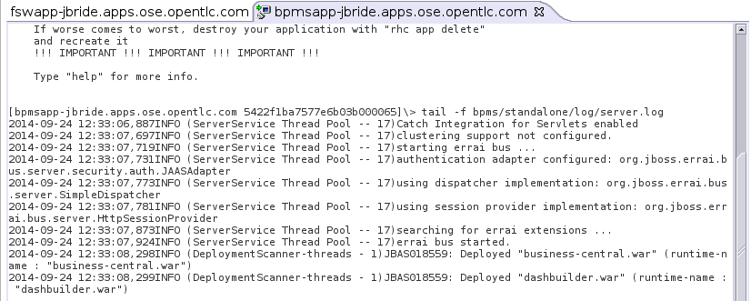

:data-uri:
:toc2:
:bpmproduct: link:https://access.redhat.com/site/documentation/en-US/Red_Hat_JBoss_BPM_Suite/[Red Hat's BPM Suite 6 product]
:mwlaboverviewsetup: link:http://people.redhat.com/jbride/labsCommon/setup.html[Middleware Lab Overview and Set-up]

= BPM Service Tasks: spring_serviceTask

:numbered:

== Overview

.spring_servicetask
image::images/springservicetask.png[]

Purpose of this example is to demonstrate use of a custom workItemHandler that leverages the Spring framework to persist a record in an application database. 
This approach should be avoided if possible. 
Instead, it is preferrable that business functions that leverage third-party libraries be encapsulated as a service (as per SOA) and invoked by a SOAP/REST/EJB service task. 
In some edge cases however, SOA may not be an option and thus this business functionality needs to run in the same thread of execution as the BPM process engine.

The application database selected for this reference architecture is:  mysql.

The Spring framework functionality used to persist data is:  org.springframework.jdbc.core.JdbcTemplate

== Pre-Requisites
The remainder of this documentation provides instructions for installation, configuration and execution of this reference architecture in Red Hat's Partner Demo System.
The following is a list of pre-requisites:

. OPENTLC-SSO credentials
+
`OPENTLC-SSO` user credentials are used to log into the Red Hat Partner Demo System (PDS).
If you do not currently have an `OPENTLC-SSO` userId, please email: `OPEN-program@redhat.com`.

. Familiarity with Partner Demo System
+
If you are not already familiar with Red Hat's `Partner Demo System`, please execute what is detailed in the {mwlaboverviewsetup} guide.
Doing so will ensure that you are proficient with the tooling and workflow needed to complete this reference architecture in an OpenShift Platform as a Service environment.

. Familiarity with {bpmproduct}
. Familiarity with Spring Templates

== Provision BPM Suite 6 application

. Open the `Openshift Explorer` panel of the `JBoss` perspective of JBDS
. Right-click on the previously created connection to `broker00.ose.opentlc.com`.
+
Using your `OPENTLC-SSO` credentials, a connection to `broker00.ose.opentlc.com` should already exist after having completed the {mwlaboverviewsetup} guide.

. Select: `New -> Application` .
+
Since you have already created a domain from the previous introductory lab, the workflow for creation of a new application will be slightly different than what you are used to.
In particular, the OSE plugin will not prompt you for the creation of a new domain.

. The following `New or existing OpenShift Application` pop-up should appear:
+
image::images/new_OSE_app_bpm.png[]

.. In the `Name` text box, enter: `bpmsapp`
.. From the `Type` drop-down, select: JBoss BPMS 6.0 (rhgpe-bpms-6.0)
.. From the `Gear profile` drop-down, select: pds_medium
. Click `Next`
. A new dialogue appears entitled `Set up Project for new OpenShift Aplication`.
+
Check the check box for `Disable automatic maven build when pushing to OpenShift`.
Afterwards, Click `Next`.

. A new dialogue appears entitled `Import an existing OpenShift application`.
+
Even though it will not be used, you will be forced to clone the remote git enabled project associated with your new OpenShift application.
Select a location on your local filesystem where the git enabled project should be cloned to.
+
image::images/gitclonelocation_bpm.png[]

. Click `Finish`
. The OSE plugin of JBDS will spin for a couple of minutes as the remote BPM Suite 6 enabled OpenShift application is created.
. Eventually, the OSE plugin will prompt with a variety of pop-up related details regarding your new application.
+
Click through all of them except when you come to the dialogue box entitled `Publish bpmsapp?`.
For this dialogue box, click `No`
+
image::images/publishbpmslab.png[]

=== BPM Suite 6 App Verification

. Using the `Remote System Explorer` perspective of JBDS, open an SSH terminal and tail the `bpms/standalone/log/server.log` of your remote BPM Suite 6 enabled OSE application
. Log messages similar to the following should appear:
+

== Config and Deployment:  Local Environment

=== local: Clone this reference architecture
This reference architecture will be cloned both in your local computer as well as in your remote BPM Suite 6 Openshift environment.
To clone this reference architecture in your local environment, execute the following:

. Open the `Git` perspective of JBDS.
. In the `Git Repositories` panel, click the link that allows you to `Clone a Git Repository and add the clone to this view`
. A pop-up should appear with a name of `Source Git Repository`
. In the `URI` field, enter the following:
+
-----
https://github.com/jboss-gpe-ref-archs/bpm_servicetasks.git
-----

. Click `Next`
+

. Continue to click `Next` through the various screens
+
On the pop-up screen entitled `Local Destination`, change the default value of the `Directory` field to your preferred location on disk.
For the purposes of the remainder of these instructions, this directory on your local filesystem will be referred to as:  $REF_ARCH_HOME

. On the last screen of the `Clone Git Repository` pop-up, click `Finish`
+
Doing so will clone this `bpm_servicetasks` project to your local disk

=== local: Build the Reference Architecture
This reference architecture includes a _spring sub-project that needs to be built locally.
To build this _spring sub-project, execute the following:

. In JBDS, switch to the `Project Explorer` panel and select :  `Import -> Maven -> Existing Maven Projects`
. In the `Root Directory` field of the `Maven Projects` pop-up, navigate to the location on disk where the project was just cloned to and select `bpm_servicetasks/spring`.
. Click `Next` and then `Finish`
+

. After importing, there should be a top-level project called `spring.parent`
. Right-click this `spring.parent` project and select: `Run As -> Maven Install`
+
Most likely, execution of this step will take about 15-20 seconds due to the download of Spring dependencies.

. In the `Console` panel, a `BUILD SUCCESS` log message should appear.
+

+
The end-result is a zip file that contains all the needed Spring framework libraries packaged as a JBoss Module:
+
-----
$ jar -tf $REF_ARCH_HOME/spring/modules/target/persistence.service.modules.zip
org/
org/spring/
org/spring/main/
org/spring/main/spring-context-3.2.3.RELEASE.jar
org/spring/main/spring-jdbc-3.2.3.RELEASE.jar
org/spring/main/spring-beans-3.2.3.RELEASE.jar
org/spring/main/spring-tx-3.2.3.RELEASE.jar
org/spring/main/spring-core-3.2.3.RELEASE.jar
org/spring/main/README.txt
org/spring/main/module.xml
-----
+
Of note are the contents of:  org/spring/main/module.xml .
It defines a new JBoss Module called:  _org.spring_ .
+
-----
<module xmlns="urn:jboss:module:1.1" name="org.spring">

    <resources>
        <resource-root path="spring-context-3.2.3.RELEASE.jar"/>
        <resource-root path="spring-jdbc-3.2.3.RELEASE.jar"/>
        <resource-root path="spring-beans-3.2.3.RELEASE.jar"/>
        <resource-root path="spring-tx-3.2.3.RELEASE.jar"/>
        <resource-root path="spring-core-3.2.3.RELEASE.jar"/>
    </resources>

    <dependencies>
        <module name="org.apache.commons.logging" />
        <module name="javax.api" />
    </dependencies>
</module>
-----

=== BPM Suite 6: Deploy Spring framework JBoss module
These Spring framework libraries are going to be added to the java classpath of your remote BPM Suite 6 runtime as JBoss modules.

==== Sftp persistence.service.modules.zip
. Switch to the `Remote File Explorer` perspective of JBDS
. Navigate to `Local -> Local Files -> $REF_ARCH_HOME/spring/modules -> target`
. Right-click `persistence.service.modules.zip` and select `copy`
. Paste into `<your.app>.apps-ose.opentlc.com -> Sftp Files -> My Home -> app-root -> data`
+

==== Unzip persistence.service.modules.zip
The Spring libraries archived in a zip file and pushed to your BPM Suite 6 environment in the previous section now needs to be unzipped and made available as a new JBoss Module.

. While still in the `Remote System Explorer` perspective of JBDS, open a ssh terminal to your remote BPM enabled OpenShift gear.
. execute:
+
-----
unzip $OPENSHIFT_DATA_DIR/persistence.service.modules.zip -d $OPENSHIFT_DATA_DIR/appModules
-----

==== Define explicit dependency
Now that the `org.spring` JBoss module (and corresponding libraries) have been deployed, the BPM Suite 6 business-central web archive needs to define an explicit dependency on the new JBoss Module.
Do so as follows:

. While still in the `Remote System Explorer` perspective of JBDS, open a ssh terminal to your remote BPM enabled OpenShift gear.
. vi `~/bpms/standalone/deployments/business-central.war/WEB-INF/jboss-deployment-structure.xml`
. scroll down toward the bottom of the file and enter a new explicit dependency as follows:
+
-----
<module name="org.spring" export="true" services="import" meta-inf="import"/>
-----
+
The modification should look similar to the following:
+

. save the change to `jboss-deployment-structure.xml` and exit.

=== BPM Suite 6:  deploy the Spring workItemHandler
This reference architecture includes a Spring-based custom workItemHandler at:  $REF_ARCH_HOME/spring/wih/src/main/java/com/redhat/gpe/refarch/bpm_servicetasks/processtier/SpringPersistenceWIH.java.

Take a minute to review the code.

Deploy the SpringPersistenceWIH class as follows:

. Using the `Remote System Explorer` perspective of JBDS, copy $REF_ARCH_HOME/spring/wih/target/spring.wih-1.0.jar
. Paste into `<your.app>.apps-ose.opentlc.com -> Sftp Files -> My Home -> bpms -> standalone -> deployments -> WEB-INF -> lib

=== BPM Suite 6: Define Service Task mapping
This reference architecture includes a BPMN process definition called:  _spring_servicetask_.
This process definition includes a Service Task called: _SpringServiceTask_.
This name now needs to be mapped to our custom Spring-based workItemHandler.
Do this in the _CustomWorkItemHandlers.conf_ file of the business-central web archive:

. Using the `Remote System Explorer` perspective of JBDS, ssh into your remote BPM Suite 6 environment.
. edit:  bpms/standalone/deployments/business-central.war/WEB-INF/classes/META-INF/CustomWorkItemHandlers.conf
.. notice the existing mappings for various base-product Service Tasks (Log, WebService, Rest)
.. add a comma to the end of the last service task mapping and then append the following:
+
-----
"SpringServiceTask": new com.redhat.gpe.refarch.bpm_servicetasks.wih.SpringPersistenceWIH(ksession)
-----
+

=== App RDBMS: Create database objects

The Spring custom work item handler included in this reference architecture, writes to a _customer_ table in a _test_ database.
This section documents the creation of these database objects using MySQL.

. In `Remote System Explorer`, open a ssh terminal to your remote BPM Suite 6 OpenShift environment.
. Execute: `mysql $OPENSHIFT_APP_NAME`
. At the mysql command prompt, enter the following:
+
-----
mysql> create table customer(id int(11) NOT NULL AUTO_INCREMENT, firstname varchar(255), lastname varchar(255), primary key (id));
Query OK, 0 rows affected (0.01 sec)
-----

=== BPM Suite 6: Add XA datasource to JBoss EAP 6
The Spring custom work item handler executes a JNDI lookup for a datasource pool called:  _test-cp-xa_.
Subsequently, a new datasource with this name should be configured in JBoss EAP.

 
. In `Remote System Explorer`, open a ssh terminal to your remote BPM Suite 6 OpenShift environment.
. vi `bpms/standalone/configuration/standalone.xml`
. Drop down to about line 121 where the existing `ExampleDS` datasource is defined.
. Copy the entire `ExampleDS` datasource and paste just below it.
Make the following changes to this copied datasource:
.. jndi-name : java:jboss/datasources/test-cp-xa
.. pool-name : test-cp-xa
.. connection-url  :  remove this element
.. Add `xa-datasource-property` elements of `ServerName` and `DatabaseName` as seen above

. Bounce your remote BPM Suite 6 java run-time using the via the `OpenShift Explorer` plugin of JBDS.

=== BPM Suite 6: Clone this reference architecture
This reference architecture includes a KIE project called: _processTier_ .
The _processTier_ project includes several BPMN2 process definitions that show-case invocation of remote SOA services via standard transports.

Use the following steps to clone this reference architecture in BPM Suite 6:

. Log into the Business-Central web application of BPM Suite 6
. navigate to:  Authoring -> Administration.
. Select `Organizational Units` -> `Manage Organizational Units`
. Under `Organizational Unit Manager`, select the `Add` button
. Enter a name of _gpe_ and an owner of _jboss_. Click `OK`
. Clone this fsw_bpms_integration repository in BPM Suite 6
.. Select `Repositories` -> `Clone Repository` .
.. Populate the _Clone Repository_ box as follows and then click _Clone_ :

image::images/clone_repo.png[]

Enter _bpmservicetasks_ as the value of the _repository name_.
The value of _Git URL_ is the URL to this reference architecture in github:

-----
https://github.com/jboss-gpe-ref-archs/bpm_servicetasks.git
-----

Once successfully cloned, BPM Suite 6 will pop-up a new dialog box with the message:  _The repository is cloned successfully_

=== BPM Suite 6:  Build and Deploy _processTier_ project
. Build and Deploy the _processTier_ project by executing the following:
.. Authoring -> Project Authoring -> Tools -> Project Editor -> Build and Deploy
. If interested, verify deployment:
.. Deploy -> Deployments

== Manual Testing
This reference architecture includes a BPMN2 called: _spring_servicetask.bpmn2_.
It can be executed manually as follows:

. Navigate to:  Process Management -> Process Definitions
. Select the _Start_ icon of any of the _spring_servicetask.bpmn2_ process definition.
. A form should appear with only a _play_ button to start that specific process.
. Make sure your `~/bpms/standalone/log/server.log` is being tailed and click this play button.

=== RESULTS:  spring_servicetask
The _customer_ table of your application database should now include a record as follows:

-----
bash-4.2$ mysql $OPENSHIFT_APP_NAME

mysql> select * from customer;
 id |   firstname   | lastname 
----+---------------+----------
  1 | Azra and Alex | Bride
(1 row)
-----

You now have configured and tested a custom workItemHandler that leverages the Spring framework to persist to an application database.
