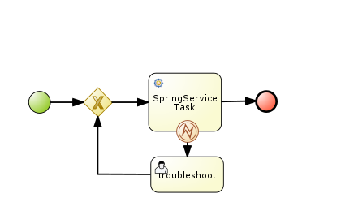
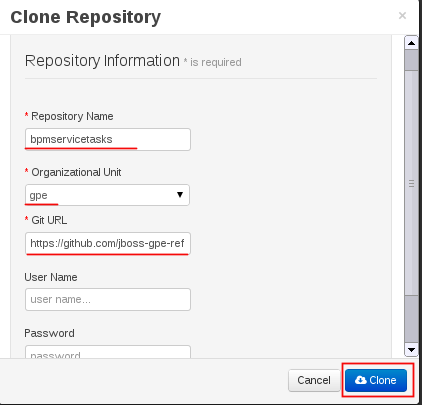

= BPM Service Tasks: spring_serviceTask

:numbered:

== Overview

Purpose of this example is to demonstrate use of a custom workItemHandler that leverages the Spring framework to persist a record in a database. 
This approach should be avoided if possible. 
Instead, it is preferrable that business functions that leverages third-party libraries be encapsulated as a service (as per SOA) and invoked by a SOAP/REST/EJB service task. 
In some edge cases however, SOA may not be an option and thus this business functionality needs to run in the same thread of execution as the BPM process engine.

== Config and Deployment:  Local Environment

=== local:  Clone this reference architecture

This reference architecture will be cloned both in your local computer as well as in your remote BPM Suite 6 Openshift environment.
To clone this reference architecture in your local environment, execute the following:

--------
git clone https://github.com/jboss-gpe-ref-archs/bpm_servicetasks.git
--------

Doing so will create a directory in your local computer called:  bpm_servicetasks.
For the purposes of this documentation, this directory will be referred to as $REF_ARCH_HOME.

=== local: Build the Reference Architecture
This reference architecture includes a _modules_ sub-project that needs to be built locally.
To build the various sub-projects, execute the following:

. cd $REF_ARCH_HOME/modules
. mvn clean install -DskipTests

+
The end-result is a zip file that contains all the needed Spring framework libraries packaged as a JBoss Module in a new _gpe_ directory:

+
-----
$ jar -tf $REF_ARCH_HOME/modules/target/persistence.service.modules.zip
modules/
modules/README.txt
modules/system/
modules/system/layers/
modules/system/layers/gpe/
modules/system/layers/gpe/org/
modules/system/layers/gpe/org/spring/
modules/system/layers/gpe/org/spring/main/
modules/system/layers/gpe/org/spring/main/module.xml
modules/system/layers/gpe/org/spring/main/spring-context-3.2.3.RELEASE.jar
modules/system/layers/gpe/org/spring/main/spring-jdbc-3.2.3.RELEASE.jar
modules/system/layers/gpe/org/spring/main/spring-beans-3.2.3.RELEASE.jar
modules/system/layers/gpe/org/spring/main/spring-tx-3.2.3.RELEASE.jar
modules/system/layers/gpe/org/spring/main/spring-core-3.2.3.RELEASE.jar
-----

+
These Spring framework libraries are going to be added to the java classpath of your remote BPM Suite 6 runtime.

. Secure copy this zip library to your remote BPM Suite 6 environment:

-----
scp $REF_ARCH_HOME/modules/target/persistence.service.modules.zip <ssh.url.to.your.bpm.environment>:/tmp
-----

=== BPM Suite 6: Register Spring framework JBoss module as explicit dependency

. ssh to your remote BPM Suite 6 environment
. cd $JBOSS_HOME
. unzip /tmp/persistence.service.modules.zip
. edit $JBOSS_HOME/modules/layers.conf and append the name _gpe_ to the list of _layers_ :

-----
layers=bpms,gpe
-----

. edit $JBOSS_HOME/standalone/deployments/business-central.war/WEB-INF/jboss-deployment-structure.xml
.. go to the bottom of the file and add a module dependency on the new _org.spring_ JBoss Module:

-----
<module name="org.yaml.snakeyaml" export="true" services="import" meta-inf="import"/>

<module name="org.spring" export="true" services="import" meta-inf="import"/>

  </dependencies>
</deployment>
</jboss-deployment-structure>
-----

. Bounce your BPM Suite 6 java run-time.

=== RDBMS: Create a new example _test_ database and _customer_ table

The Spring custom work item handler included in this reference architecture, writes to a _customer_ table in a _test_ database.
This section documents the creation of these database objects using PostgreSQL.
Modify these instructions as appropriate for your application database

. (as postgres user) :  enable prepared transactions by uncommenting the following in ~/data/postgresql.conf

-----
max_prepared_transactions = 10 
-----

. restart postgresql
. (as postgres user) : create user test with password 'test';
. (as postgres user) : createdb -O test test
. (as postgres user) : psql test

-----
test=# create table customer(id int8 not null, firstname varchar(255), lastname varchar(255), primary key (id));
test=# grant all privileges on table customer to test;
-----

=== BPM Suite 6: Add XA datasource to JBoss EAP 6
The Spring custom work item handler executes a JNDI lookup for a datasource pool called:  _test-cp-xa_.
Subsequently, a new datasource with this name should be configured in JBoss EAP.
The following example is postgresql specific.
Modify as needed for your application database.

-----
                <xa-datasource jndi-name="java:jboss/datasources/test-cp-xa" pool-name="test-cp-xa" enabled="true">
                    <xa-datasource-property name="ServerName">
                        172.9.4.3
                    </xa-datasource-property>
                    <xa-datasource-property name="DatabaseName">
                        test
                    </xa-datasource-property>
                    <xa-datasource-class>org.postgresql.xa.PGXADataSource</xa-datasource-class>
                    <driver>postgresql</driver>
                    <new-connection-sql>select 1;</new-connection-sql>
                    <xa-pool>
                        <min-pool-size>1</min-pool-size>
                        <max-pool-size>5</max-pool-size>
                    </xa-pool>
                    <security>
                        <user-name>test</user-name>
                        <password>test</password>
                    </security>
                </xa-datasource>

-----
 
=== BPM Suite 6: Clone this reference architecture
This reference architecture includes a KIE project called: _processTier_ .
The _processTier_ project includes several BPMN2 process definitions that show-case invocation of remote SOA services via standard transports.

Use the following steps to clone this reference architecture in BPM Suite 6:

. Log into the Business-Central web application of BPM Suite 6
. navigate to:  Authoring -> Administration.
. Select `Organizational Units` -> `Manage Organizational Units`
. Under `Organizational Unit Manager`, select the `Add` button
. Enter a name of _gpe_ and an owner of _jboss_. Click `OK`
. Clone this fsw_bpms_integration repository in BPM Suite 6
.. Select `Repositories` -> `Clone Repository` .
.. Populate the _Clone Repository_ box as follows and then click _Clone_ :

Enter _bpmservicetask_ as the value of the _repository name_.
The value of _Git URL_ is the URL to this reference architecture in github:

-----
https://github.com/jboss-gpe-ref-archs/bpm_servicetask.git
-----

Once successfully cloned, BPM Suite 6 will pop-up a new dialog box with the message:  _The repository is cloned successfully_

=== local:  enable the Spring custom work item handler
This reference architecture includes a Spring custom workItemHandler at:  $REF_ARCH_HOME/processTier/src/main/java/com/redhat/gpe/refarch/bpm_servicetasks/processtier/SpringPersistenceWIH.java.bk
This is a java source file with the additional _.bk_ suffix added so as to not compile by default and interfere with other examples in this reference architecture that do not use Spring libraries.
Execute the following in your local environment to enable this Spring custom workItemHandler:

-----
cd $REF_ARCH_HOME
git mv processTier/src/main/java/com/redhat/gpe/refarch/bpm_servicetasks/processtier/SpringPersistenceWIH.java.bk  processTier/src/main/java/com/redhat/gpe/refarch/bpm_servicetasks/processtier/SpringPersistenceWIH.java
git commit -m 'enabling Spring WIH'
git push docker_bpms master
-----

The last command from above, pushes the change in the bpm_servicetasks git project to the .niogit/bpmservicetasks bare repository used by BPM Suite 6.

=== BPM Suite 6:  Build and Deploy _processTier_ project
. Build and Deploy the _processTier_ project by executing the following:
.. Authoring -> Project Authoring -> Tools -> Project Editor -> Build and Deploy
. If interested, verify deployment:
.. Deploy -> Deployments

== Manual Testing
This reference architecture includes a BPMN2 called: _spring_servicetask.bpmn2_.
It can be executed manually as follows:

. Navigate to:  Process Management -> Process Definitions
. Select the _Start_ icon of any of the _spring_servicetask.bpmn2_ process definition.
. A form should appear with only a _play_ button to start that specific process.
. Make sure your $JBOSS_HOME/standalone/log/server.log is being tailed and click this play button.

=== RESULTS:  spring_servicetask
The _customer_ table of your application database should now include a record as follows:

-----
bash-4.2$ psql test
psql (9.2.7)
Type "help" for help.

test=# select * from customer;
 id |   firstname   | lastname 
----+---------------+----------
  0 | Azra and Alex | Bride
(1 row)
-----

You now have configured and tested a custom workItemHandler that leverages the Spring framework to persist to an application database.

